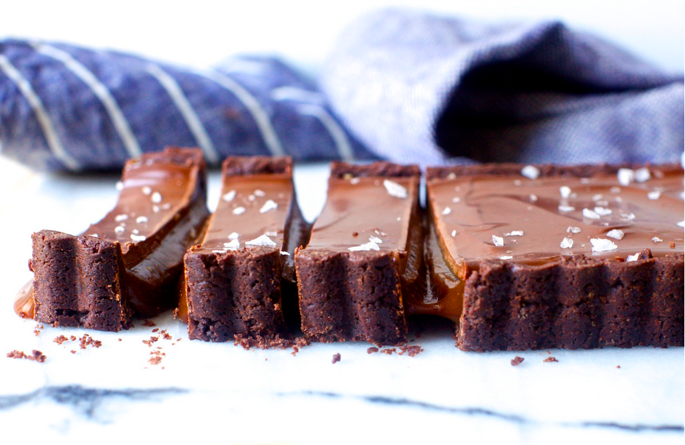

```{r setup, include=FALSE}
knitr::opts_chunk$set(echo = TRUE)
```

# Star Wars Character: [Anakin Skywalker](https://starwars.fandom.com/wiki/Anakin_Skywalker)


> You're reckless, little one. You never would have made it as Obi-Wan's Padawan… but you might make it as mine.

Description | Value
----------- | -----
Species     | Human
Gender      | Male
Hair color  | Blond to brown
Eye color   | Blue, yellow
Skin color  | Light, later pale
Height      | 1.88 meters

--------

# Recipe: [Chocolate Caramel Tart](https://smittenkitchen.com/2018/12/chocolate-caramel-tart/)



## Ingredients

#### Crust

* 1/2 cup plus 1 tablespoon (70 grams) powdered sugar
* 1 1/4 cups (155 grams) all-purpose flour
* 1/4 cup (20 grams) Dutch-processed cocoa powder
* 1/2 cup (115 grams) unsalted butter, diced
* 1 large egg yolk
* 3/4 teaspoon vanilla extract

#### Caramel Filling

* 2 cups (400 grams) granulated sugar
* 1/2 cup (120 grams) water
* 1/4 cup (80 grams) light corn syrup
* 1/2 cup (115 grams) unsalted butter, cut into tablespoons
* 1/2 cup (120 grams) heavy cream
* 2 tablespoons (30 grams) creme fraiche or sour cream
* Pinch or two flaky sea salt

#### Ganache Topping

* 1/2 cup (120 grams) heavy cream
* 3 1/2 ounces (100 grams) bittersweet chocolate, finely chopped (Fleming requests your “best quality”)
* Pinch or two flaky sea salt

## Special kitchen tools:

* Food processor
* Stand mixer
* Waxed or parchment paper
* 9.5- to 10-inch round tart pan with a removable bottom
* Nonstick spray and foil 
* Large saucepan with a light-colored interior 
* Heatproof bowl
* Rectangular tart pan

## Steps: 

1. **Make chocolate crust in a food processor**: Pulse sugar, flour, and cocoa powder until mixed. Add butter and run the machine until it’s finely chopped and basically disappears into the dry mixture. Add yolk and vanilla and run the machine — not just pulse it — until the mixture begins to clump. It make take 30 seconds, but it will begin to form clumps.
2. **Make chocolate crust in a stand mixer**: In bowl of an electric mixer, combine the butter, flour, confectioners’ sugar and cocoa. It’s going to be bumpy at first but keep letting the machine bang it up until it is softened, and keep beating until smooth. Scrape down sides. Add egg yolk and vanilla, and mix until blended. With this method, if the mixture feels too soft to press into a crust, wrap it in waxed or parchment paper and refrigerate it until mostly firm.
3. Press crust into bottom and up sides of a 9.5- to 10-inch round tart pan with a removable bottom (for easier release). Keep a quarter-sized ball of crust aside to patch cracks later, if needed. Transfer pan to freezer and freeze until solid, about 20 minutes. Meanwhile, heat oven to 325 degrees F.
4. **Bake crust**: Prick frozen crust with a fork, coat a piece of foil with nonstick spray, and press it oiled-side-down tightly against the frozen crust, so it is fully molded to the shape. Bake tart with foil (no pie weights needed) for 15 minutes, then carefully, gently, a little at a time, peel back foil and discard. If cracks have form, this is when you patch them with reserved dough. Return to oven for 5 to 10 minutes more, until pastry looks dry and set. Let cool on a rack while you make the caramel.
5. **Make caramel**: In a large saucepan with a light-colored interior (this will make it easier to see the caramel’s color), combine the sugar, water, and corn syrup, then turn heat to medium-high. Cook undisturbed (no stirring needed, just tilt and swirl the pan if it looks uneven but really this shouldn’t be very necessary) until the sugar takes on an amber or pale copper color, about 10 minutes. Remove from heat and carefully whisk in the butter — it’s going to boil up and steam, be careful — until melted, then the cream and creme fraiche or sour cream and a couple pinches of salt, until smooth. Pour into prepared crust. Let caramel set in the fridge until cool and firm, about an hour.
6. **Make ganache**: Place chopped chocolate in a heatproof bowl and bring cream to a simmer. Pour over chocolate and let sit undisturbed for 2 minutes, then whisk until smooth. Pour it over cooled caramel layer, spreading evenly with a spatula or butter knife. Let set in the fridge, another hour, or until firm to the touch.
7. **To serve**: Sprinkle the top of the tart with flaky sea salt. A knife dipped in hot water cuts fairly cleanly, but slices will become messy within a minute of being cut, so try to get them to their plates quickly.
8. **To store leftovers**: Fleming recommends doing so at room temperature, but I think it makes things too messy. Spray two small strips of foil with nonstick spray and press them against the cut/open sides of the tart and wrap them tight; this will keep it from spilling out in the fridge. Tart should keep in the fridge for a week, not that I believe it will.  

*No special season of the year.*  
**Variations**: Claudia Fleming's book *The Last Course (2001)*

--------

# Euclidean Distance

### Definition

--------
The **Euclidean distance** between points **p** and **q** is the length of the line segment connecting them ($\overline{\textbf{pq}}$).

In Cartesian coordinates, if **p** = ($p_1, p_2,\dots, p_n$) and **q** = ($q_1, q_2,\dots, q_n$) are two points in Euclidean *n*-space, then the distance (d) from **p** to **q**, or from **q** to **p** is given by the Pythagorean formula. 

$$d(\textbf{p, q}) = d(\textbf{q, p}) = \sqrt{(q_1 - p_1)^2 + (q_2 - p_2)^2 + \dots + (q_n - p_n)^2}$$
$$= \sqrt{\sum_{i=1}^{n} (q_i - p_i)^2}.$$

The position of a point in a Euclidean *n*-space is a Euclidean vector. So, **p** and **q** may be represented as Euclidean vectors, starting from the origin of the space (initial point) with their tips (terminal points) ending at the two points. The **Euclidean norm**, or **Euclidean length**, or **magnitude**, of a vector measures the length of the vector. 

$$\|\textbf{p}\| = \sqrt{p_1^2 + p_2^2 + \dots + p_n^2} = \sqrt{\textbf{p} \cdot \textbf{p}},$$

where the last expression involves the dot product.